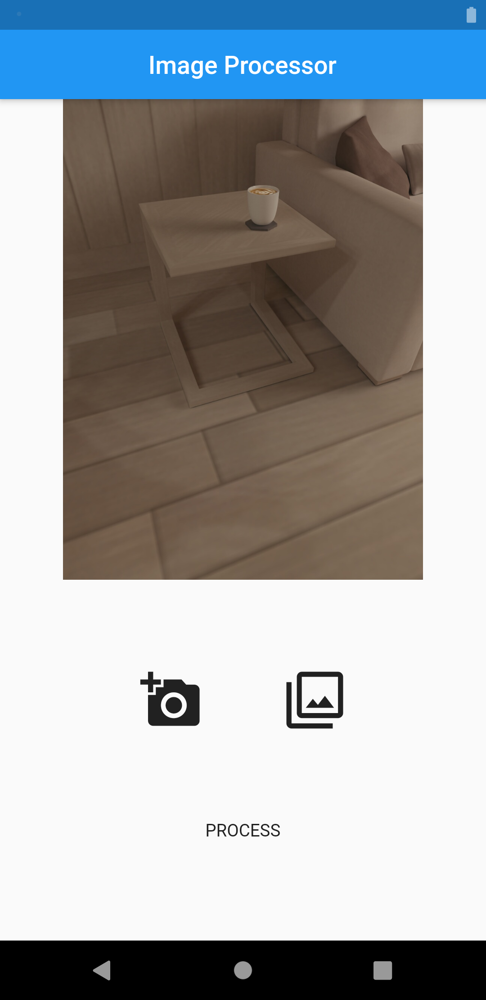
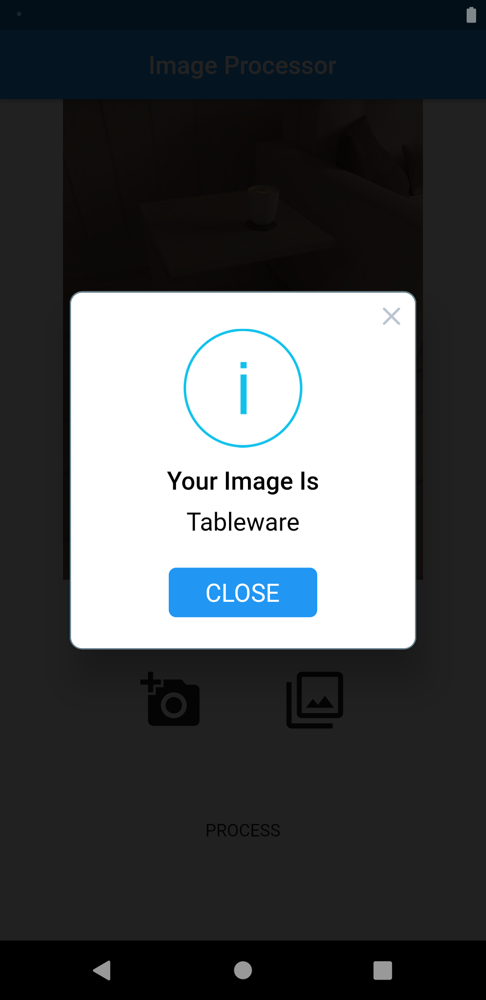

# ImageLabeler
An implementation of Identifying images Using Machine Learning in FLUTTER. I have used FireBase ML Vision Toolkit to implement Machine Learning.
You can choose any photo from your Gallery as well as Your Camera!

